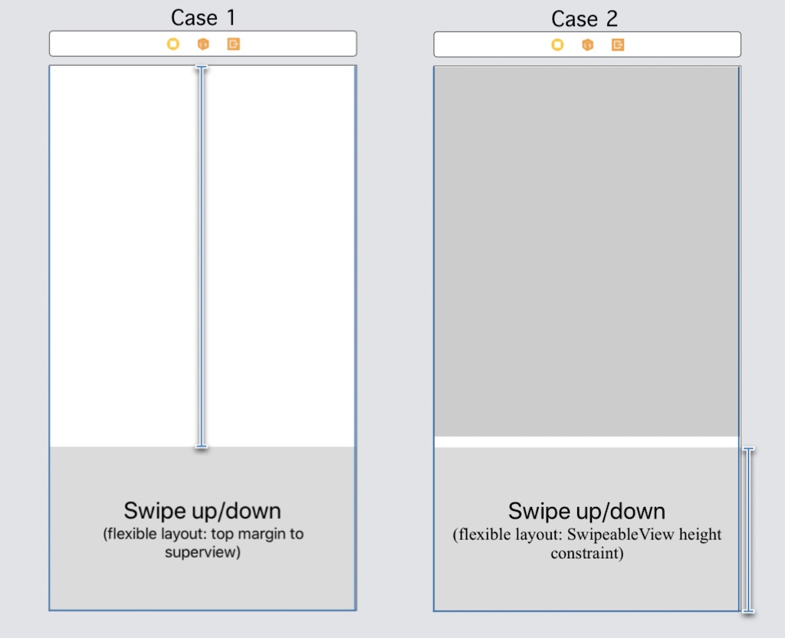

# SwipeableView

<table>
    <tr>
        <td>A simple and easy to use view component which allows to be expanded and collapsed with user gestures relying on autolayouts. It supports interpolation of items which can be animated along with it, such as UIView alpha channel, background/tint colors, center, affine transform and other constraint layouts</td>
    </tr>
    <tr>
        <td style="text-align:center"></td>
    </tr>
</table>

## Setup

In order to use the SwipeableView, all you need to do is adding the view to your view controller or another view which need to contain it, and then "plug" the layout which will make the SwipeableView able to be expanded or collapsed, with or without user gestures (pan gesture recognizer).

The example below will show how do to this, assuming the view has been plugged in a view controller, where we want it to be expandable from the top, up to fullfilling the view controller view (Case 1) or expanding up to double the size (Case 2):



Here the code for the case 1 (where the flexible layout will be the top margin constraint to the super view):
```swift
/// The swipeable view which can expand and collapse
@IBOutlet weak var swipeableView: SwipeableView!
/// The reference to the layout constraint connected to the SwipeableView, which will be affected by the expand/collapse
@IBOutlet weak var flexLayout: NSLayoutConstraint!
    
override func viewDidLoad() {
  super.viewDidLoad()
  // Set the flexible layout to the SwipeableView. This will let the layout constant value change from his current value to 0
  // You can customize the 'start' and 'end' values which the layout can assume, see the init method of SwipeableItemLayout
  self.swipeView.flexibleLayout = SwipeableItemLayout(with: self.flexLayout)
}
```

Here the code for the case 2 (where the flexible layout will the actual height constraints of the SwipeableView):
```swift
/// The swipeable view which can expand and collapse
@IBOutlet weak var swipeableView: SwipeableView!
/// The reference to the layout constraint connected to the SwipeableView, which will be affected by the expand/collapse
@IBOutlet weak var flexLayout: NSLayoutConstraint!
    
override func viewDidLoad() {
  super.viewDidLoad()
  // Indicates the SwipeableView that the gesture should be considered inverted. This fit this case, where we want the flexLayout to move from
  // his current value, not to 0 like case 1, but instead to the double of his current value
  self.swipeableView.isPanGestureInverted = true
  // Set the flexible layout to the SwipeableView. This will let the layout constant value change from his current value to his double
  self.swipeView.flexibleLayout = SwipeableItemLayout(with: self.flexLayout, end: self.flexLayout.constant * 2)
}
```

## SwipeableViewProtocol

It provides support for delegation with `SwipeableViewProtocol`, by providing 3 simple methods:
* `swipeableViewDidExpand(...)` : called when the view is fully expanded
* `swipeableViewDidCollapse(...)` : called when the view is fully collapsed
* `swipeableViewDidPan(...)` : called while user pan over the view, for manually expanding and collapsing

Refer to the show case 1 (Basic configurations) in the project for more details

## Swipe directions

This component can be configured for using both vertical and horizontal axis and, together with the actual layout constraint you will plug as flexible layuout, will expand/collapse accordingly. Along with it, you can therefore customize the position of the swipe indicator bar, to be at the top, bottom, left or right. Refer to the show case 2 (Indicator positions) in the project for the full view on this

Here an example for achieving this:  
```swift
  // Swipe from top to bottom. Set the swip indicator bar to be shown at the bottom of the view, and plug the layout as usual 
  swipeView.indicatorPosition = .bottom
  swipeView.flexibleLayout = SwipeableItemLayout(with: flexSwipeTopToBottom, end: view.frame.height / 3)

  // Swipe from left to right. Indicate the axis are not vertical (so, horizontal) and set the swip indicator bar to 
  // be shown on the right side of the view, so finally plug the layout as usual 
  swipeView.indicatorPosition = .right
  swipeView.flexibleLayout = SwipeableItemLayout(with: flexSwipeLeftToRight, verticalAxis:false, end: view.frame.width / 2)
```

## SwipeableView configurations

The SwipeableView comes along with a small set of configurable parameters and features, such as:
* hide/show the swipe indicator bar
* swipe indicator bar position
* enable or disable rounded corners according with the current swipe indicator bar position
* customizing the swipe indicator bar colors
* add or remove a child view controller
* interaction with any child view controller based on the expanded or collapsed state
* expand or collapse the SwipeableView programmatically
* returning the current expanding/collapsing percentage

Refer to the show case (1) (Basic configurations) in the project for the full example on those aspects
